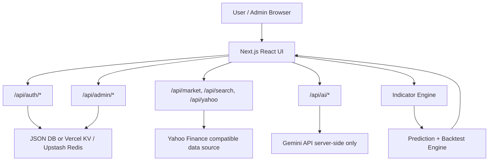

# StockSense Pro Complete Technical Documentation

Last updated: 2026-07-10

## 1. Project Overview

StockSense Pro is a Next.js 15 + TypeScript stock market analytics platform for Indian and global market analysis. It includes market search, technical charting, AI-assisted educational predictions, candlestick pattern detection, backtesting, AI screener, options-chain analytics, paper trading, portfolio tracking, and a Free/Pro subscription control center.

The platform is for educational and analytical use only. It is not financial advice, not a buy/sell recommendation system, and does not guarantee returns.

## 2. Technology Stack

- Framework: Next.js 15 App Router
- Language: TypeScript
- UI: React 19, Tailwind CSS, lucide-react
- Charting: lightweight-charts
- Technical indicators: technicalindicators
- Testing: Vitest
- AI: Gemini API through server-side routes only
- Auth/session: signed HTTP-only cookies
- Local storage: JSON file at `data/stocksense-db.json`
- Production durable storage: optional Vercel KV / Upstash Redis REST
- Deployment: Vercel

## 3. Main Application Modules

- Dashboard: stock search, market data, chart, indicators, AI prediction, paper trading panel.
- AI Screener: scans Indian stocks for bullish/bearish setups.
- Options Chain: generated options-chain analytics with OI, PCR, support/resistance and max pain logic.
- Portfolio: holdings, current value, P&L and allocation logic.
- Paper Trading: virtual account, buy/sell, holdings, average price, stop-loss and target simulation.
- Subscription Control Center: admin user creation, Free/Pro/Expired/Blocked user management, payment review, UPI settings.
- Auth: email/password signup/login, Google Sign-In support, HTTP-only session cookies.

## 4. Folder Structure

```text
app/
  page.tsx                         Dashboard
  admin/page.tsx                   Subscription Control Center
  screener/page.tsx                AI stock screener
  options/page.tsx                 Options chain analytics
  portfolio/page.tsx               Portfolio and paper trading
  upgrade/page.tsx                 Pro payment request flow
  account/page.tsx                 Account and password management
  api/
    auth/                          Login, signup, Google auth, me, logout
    admin/                         Admin users, payments, settings
    market/                        Server-side market data route
    search/                        Market search route
    ai/                            Gemini-backed AI routes
    subscription/plans/            Public plan list

components/
  AuthModal.tsx                    Sign in/up + Google Sign-In UI
  SearchBar.tsx                    Symbol search and exchange/timeframe controls
  StockChart.tsx                   Candlestick chart, volume and indicator overlays
  AIPredictionPanel.tsx            Prediction, target, stop loss, logic explanation
  ProGuard.tsx                     Feature access gate
  PaperTradingPanel.tsx            Trading controls
  SubscriptionBadge.tsx            Free/Pro/Blocked status badge
  LegalDisclaimer.tsx              Educational disclaimer

lib/
  marketData.ts                    Yahoo/server market fetch logic
  dataFetcher.ts                   Client data fetch wrapper and CSV parser legacy utility
  symbolResolver.ts                NSE/BSE/MCX/US/global symbol resolution
  indicators.ts                    SMA, EMA, RSI, MACD, BB, VWAP, ATR, ADX, support/resistance
  patterns.ts                      Candlestick pattern detection
  aiPrediction.ts                  Prediction score, target/SL, backtest and explanation logic
  portfolio.ts                     Portfolio and trade calculations
  optionsData.ts                   Options-chain model
  subscription.ts                  Free/Pro/Expired/Blocked status logic
  auth.tsx                         Client auth provider
  server/
    auth.ts                        Signed session cookies, auth guards
    db.ts                          JSON / Redis REST storage adapter
    password.ts                    PBKDF2 password hashing
    rateLimit.ts                   In-memory rate limiting
    validation.ts                  Input validation

tests/
  aiPrediction.test.ts
  backtest.test.ts
  indicators.test.ts
  password.test.ts
  portfolio.test.ts
  subscription.test.ts
  symbolResolver.test.ts
```

## 5. High-Level Architecture



## 6. Market Data Logic

Market data is fetched server-side or through controlled API routes. The UI does not call external APIs with secret keys.

Supported areas:

- NSE stocks
- BSE stocks
- MCX-style commodities through symbol mapping and global proxy/benchmark where required
- US equities
- Global commodities
- Crypto and forex pairs
- Indices such as NIFTY and BANKNIFTY

Core files:

- `lib/symbolResolver.ts`
- `lib/marketData.ts`
- `lib/dataFetcher.ts`
- `app/api/market/route.ts`
- `app/api/search/route.ts`

### Symbol Resolution

The resolver normalizes user input and maps it to likely provider symbols.

Examples:

- `RELIANCE` -> `RELIANCE.NS`
- `TATAMOTORS` -> `TATAMOTORS.NS`
- `ZOMATO` -> `ZOMATO.NS`
- `NIFTY` -> `^NSEI`
- `BANKNIFTY` -> relevant NSE index symbol mapping
- `GOLD`, `SILVER`, `CRUDEOIL`, `COPPER` -> MCX/global benchmark mappings
- US symbols such as `AAPL`, `MSFT`, `NVDA` stay as US symbols

### Data Quality

The app stores metadata with fetched data:

- requested symbol
- resolved symbol
- exchange
- provider
- range
- interval
- fetched timestamp
- source timestamp
- currency
- data quality
- fallback chain
- warnings

This is important because stock market data can be delayed, estimated, or provider-limited.

## 7. Technical Indicator Logic

Core file: `lib/indicators.ts`

Indicators calculated:

- SMA 50 and SMA 200
- EMA 20, EMA 50, EMA 200
- RSI 14
- MACD
- Bollinger Bands
- VWAP
- ATR
- Stochastic
- ADX
- Pivot points
- Support/resistance levels
- Trend score

### Trend Score

Trend score combines:

- EMA stacking
- price vs EMA 200
- RSI zone
- MACD histogram
- ADX trend strength
- VWAP position
- Bollinger Band position

Trend labels:

- Strong Bullish
- Bullish
- Neutral
- Bearish
- Strong Bearish

## 8. Support and Resistance Logic

Support and resistance are calculated from recent candle swing highs and swing lows.

Process:

1. Scan recent candle window.
2. Detect local lows as support candidates.
3. Detect local highs as resistance candidates.
4. Bucket nearby levels using tolerance based on current price.
5. Keep levels with repeated touches.
6. Sort by touch count and distance from current close.

This is used for:

- target estimation
- stop-loss estimation
- chart context
- prediction explanation

## 9. Candlestick Pattern Detection

Core file: `lib/patterns.ts`

Patterns include:

- Bullish Engulfing
- Bearish Engulfing
- Hammer
- Shooting Star
- Marubozu Bullish
- Marubozu Bearish
- Morning Star
- Evening Star

Each detected pattern contains:

- candle index
- pattern name
- bullish/bearish type

## 10. Backtesting Logic

Core file: `lib/aiPrediction.ts`

Backtesting is candle-based and educational. For each detected pattern occurrence:

1. Use pattern candle close as entry reference.
2. Calculate 5-candle, 10-candle and 20-candle returns.
3. Calculate max upside and max downside.
4. Calculate directional win rate based on pattern bias.
5. Calculate average return.
6. Calculate worst drawdown.
7. Assign sample quality.

Sample quality:

- `high`: 25 or more occurrences
- `medium`: 10 to 24 occurrences
- `low`: fewer than 10 occurrences

Example:

```text
Sample 147 high
```

Meaning:

- the same pattern appeared 147 times historically
- sample quality is high
- backtest stats are more useful than a low-sample pattern

## 11. AI Prediction Engine Logic

Core file: `lib/aiPrediction.ts`

The prediction engine is a rule-based technical model with optional Gemini narrative. The trading signal is not generated by blindly asking AI. The deterministic engine first calculates the setup using indicators, patterns, volume, support/resistance and backtest results.

### Signal Scores

The engine starts from trend score and adds/subtracts evidence:

- Trend score contribution
- EMA stack
- EMA 200
- VWAP
- RSI
- Stochastic
- MACD
- Bollinger Bands
- Candlestick pattern backtest
- Volume confirmation
- Live candle movement

### Signal Mapping

```text
score >= 60   -> Strong Buy
score >= 30   -> Buy
score <= -60  -> Strong Sell
score <= -30  -> Sell
otherwise     -> Neutral
```

### Target and Stop-Loss Logic

Target and stop loss are direction-aware:

- Buy / Strong Buy: target must be above latest live close.
- Sell / Strong Sell: target must be below latest live close.
- Neutral with positive score: uses upside/resistance side.
- Neutral with negative score: uses downside/support side.

If support/resistance is not valid for the direction, ATR-based fallback is used.

### Risk-Reward Logic

Risk-reward is calculated as:

```text
reward = abs(target - current price)
risk = abs(current price - stop loss)
riskRewardRatio = reward / risk
```

If risk-reward is below 1.5x, the prediction adds a caution note.

## 12. Bullish/Bearish Explanation Logic

The app now explains why a result is bullish or bearish.

Prediction output contains:

- `logicBias`: bullish, bearish, or neutral
- `logicSummary`
- `bullishReasons`
- `bearishReasons`
- `neutralReasons`
- `scoreBreakdown`
- `confluenceScore`
- `riskRewardRatio`

Examples of bullish reasons:

- Price is above 20 EMA and 20 EMA is above 50 EMA.
- Price is above 200 EMA.
- Price is trading above VWAP.
- MACD histogram is above zero.
- MACD histogram is improving.
- High volume came with a green candle.
- Pattern has positive directional win rate.
- Risk-reward is acceptable.

Examples of bearish reasons:

- Price is below 20 EMA and 20 EMA is below 50 EMA.
- Price is below 200 EMA.
- Price is trading below VWAP.
- MACD histogram is below zero.
- MACD histogram is weakening.
- RSI is overbought.
- High volume came with a red candle.

Where it appears:

- Dashboard prediction card
- AI Screener result cards

## 13. AI Screener Logic

Core file: `app/screener/page.tsx`

The screener scans a defined list of major Indian stocks across a selected timeframe.

For every stock:

1. Fetch market data.
2. Calculate indicators.
3. Detect candlestick patterns.
4. Backtest unique patterns.
5. Generate AI prediction.
6. Calculate price change and volume ratio.
7. Apply selected strategy filter.
8. Group by bullish or bearish bias.

### Screener Strategies

Available filters include:

- All Setups
- Top Gainers
- Top Losers
- RSI Oversold
- RSI Overbought
- Volume Breakout
- MACD Crossover
- High Win Rate
- Golden Cross
- RSI Extremes
- Bollinger Squeeze
- Triple Screen Trading System
- Volatility Contraction Pattern

### Better Result Scanning Levels

Recommended scanning logic:

```text
Level 1: Data quality check
Level 2: Market trend check
Level 3: Sector filter
Level 4: Stock trend score
Level 5: Volume confirmation
Level 6: Momentum confirmation
Level 7: Pattern backtest
Level 8: Risk-reward validation
Level 9: Explanation and disclaimer
```

## 14. Options Chain Logic

Core file: `lib/optionsData.ts`

Options chain currently uses generated/estimated analytics rather than official broker exchange data.

Includes:

- CE/PE modeled option price
- OI
- IV
- LTP
- PCR
- max pain
- support from PE OI
- resistance from CE OI

Important note: Production-grade options analytics should use official or licensed NSE/BSE/F&O data where available.

## 15. Paper Trading Logic

Core files:

- `lib/portfolio.ts`
- `lib/usePaperTrading.ts`
- `components/PaperTradingPanel.tsx`

Features:

- Virtual balance
- Buy
- Sell
- Holdings
- Average price
- Trade history
- Live P&L
- Stop-loss
- Target

P&L formula:

```text
pnl = (currentPrice - averagePrice) * shares
pnlPercent = ((currentPrice - averagePrice) / averagePrice) * 100
```

Risk trigger:

- if current price <= stop loss -> STOP_LOSS
- if current price >= target -> TARGET

## 16. Portfolio Logic

Core file: `lib/portfolio.ts`

Portfolio calculations include:

- invested value
- current value
- P&L
- P&L percentage
- allocation
- realized P&L on sell
- currency handling for INR/USD positions

## 17. Subscription System

Core file: `lib/subscription.ts`

User statuses:

- free
- pending
- pro
- expired
- blocked

Roles:

- user
- admin

Access rules:

- Free user can use basic dashboard/search/chart features.
- Pro user can access advanced modules.
- Admin can manage users, payments and settings.
- Blocked user cannot use protected routes.

Pro access can be granted by:

- admin status update
- admin-created user with Pro status
- approved payment request
- calendar active dates

## 18. Admin Subscription Control Center

Core file: `app/admin/page.tsx`

Admin can:

- View users
- Search users
- Create users manually
- Assign Free/Pro/Pending/Expired/Blocked status
- Set Pro start/end dates
- Add active calendar dates
- Block/unblock users
- Review UPI payment requests
- Approve/reject payments
- Configure UPI ID, QR image URL and plan settings

Admin create-user flow:

```text
Admin fills name, mobile, email, temporary password
Admin selects status
If status is pro, admin selects start/end dates
POST /api/admin/users
Server validates admin session
Server validates input
Server hashes password
Server creates user
UI adds user to admin list
```

## 19. Authentication and Session Logic

Core files:

- `lib/auth.tsx`
- `lib/server/auth.ts`
- `app/api/auth/login/route.ts`
- `app/api/auth/signup/route.ts`
- `app/api/auth/google/route.ts`
- `app/api/auth/me/route.ts`
- `app/api/auth/logout/route.ts`

### Password Auth

- Passwords are hashed with PBKDF2 SHA-256.
- Plain passwords are never stored.
- Login sets an HTTP-only session cookie.

### Session Cookie

Cookie:

- name: `stocksense_session`
- HTTP-only
- sameSite: lax
- secure in production
- max age: 7 days

Session token contains:

- user id
- email
- role
- issued-at timestamp
- expiry timestamp

Session is signed with `AUTH_SECRET`.

Important fix:

- Server first resolves session by `userId`.
- If `userId` misses due to DB reseed/serverless restart, it falls back to signed email.
- This prevents repeated admin login prompts when admin id changes.

### Google Sign-In

Google Sign-In uses:

- `NEXT_PUBLIC_GOOGLE_CLIENT_ID` in browser
- `GOOGLE_CLIENT_ID` or same public ID on server for token audience verification
- Google tokeninfo verification server-side

New Google users start as Free.

## 20. Storage Architecture

Core file: `lib/server/db.ts`

Local:

```text
data/stocksense-db.json
```

Production recommended:

```text
KV_REST_API_URL
KV_REST_API_TOKEN
STOCKSENSE_DB_KEY
```

The app supports Vercel KV / Upstash Redis REST for durable storage.

Without durable storage on Vercel, users and subscriptions can reset after serverless cold starts. For production, Redis/KV or a real database is required.

## 21. API Security

Security features:

- Gemini key is server-side only.
- Session cookie is HTTP-only.
- Passwords are hashed.
- Auth routes have rate limiting.
- Admin routes require `requireAdmin()`.
- Pro routes use ProGuard or server-side Pro checks.
- Google token is verified on server.
- Sensitive keys should never use `NEXT_PUBLIC_` except public Google client ID.

## 22. Environment Variables

Required/recommended:

```env
GEMINI_API_KEY=
GEMINI_MODEL=gemini-3-flash-preview
AUTH_SECRET=
ADMIN_EMAIL=
ADMIN_PASSWORD=
ADMIN_NAME=
ADMIN_MOBILE=
```

Google:

```env
NEXT_PUBLIC_GOOGLE_CLIENT_ID=
GOOGLE_CLIENT_ID=
```

Durable production storage:

```env
KV_REST_API_URL=
KV_REST_API_TOKEN=
UPSTASH_REDIS_REST_URL=
UPSTASH_REDIS_REST_TOKEN=
STOCKSENSE_DB_KEY=stocksense:db:v1
```

Payment:

```env
UPI_ID=
UPI_QR_IMAGE_URL=
```

## 23. Deployment

Current production domain:

```text
https://copy-2-of-sense-pro.vercel.app
```

Build command:

```bash
pnpm run build
```

Deploy command:

```bash
pnpm dlx vercel@latest --prod --yes
```

Recommended Vercel settings:

- Add `AUTH_SECRET`
- Add `GEMINI_API_KEY`
- Add durable storage env variables
- Add Google OAuth client ID if Google Sign-In is required

## 24. Testing

Test command:

```bash
pnpm run test
```

Current test areas:

- AI prediction risk levels and explanation fields
- Backtesting
- Indicators
- Password hashing
- Portfolio calculations
- Subscription access logic
- Symbol resolver

Lint:

```bash
pnpm run lint
```

Build:

```bash
pnpm run build
```

## 25. Known Limitations

- Yahoo/provider data can be delayed or incomplete.
- MCX commodities may use estimated/global benchmark mapping where official data is unavailable.
- Options-chain analytics are modeled/estimated unless connected to official data.
- JSON file storage is not production-safe on Vercel without KV/Redis.
- AI predictions are educational and probability-based, not trade advice.
- Backtests exclude brokerage, taxes, slippage, liquidity and execution risk.
- Intraday candles can repaint before close, so signals are locked to closed candle reference where possible.

## 26. Recommended Future Improvements

High priority:

- Add durable production DB before real users.
- Add official/licensed NSE/BSE/MCX data source if commercial accuracy is required.
- Add market-wide regime filter using NIFTY, BANKNIFTY and India VIX.
- Add sector-relative strength scoring.
- Add delivery volume and F&O OI data where available.
- Add audit log for admin actions.
- Add role-based admin permissions.

AI and scanner:

- Add multi-timeframe confluence.
- Add relative strength vs NIFTY and sector index.
- Add risk-reward minimum filter.
- Add breakout-retest detection.
- Add trend-pullback detection.
- Add false-breakout risk tag.
- Add ranking by confluence score, not only confidence.

Security:

- Add CSRF protection for state-changing routes.
- Add persistent rate limit store for production.
- Add email verification for password signup.
- Add password reset flow.
- Add admin action logs.

Production:

- Add monitoring and error tracking.
- Add request logging.
- Add DB backups.
- Add separate staging and production environments.

## 27. User Flow Summary

Signup:

```text
User signs up
User starts as Free
Admin sees user in Control Center
Admin can grant Pro access
```

Admin-created user:

```text
Admin opens /admin
Admin creates user with temporary password
Admin selects status
User appears in list
Admin can manage access anytime
```

Prediction:

```text
User searches symbol
App resolves symbol
App fetches candles
App calculates indicators
App detects patterns
App runs backtest
App scores setup
App calculates target and stop loss
App shows why bullish/bearish
Optional Gemini narrative is added server-side
```

Screener:

```text
User selects timeframe, strategy, sector
App scans stock list
Each stock receives prediction and confluence score
Results are grouped into bullish and bearish tabs
Each result shows explanation logic
```

## 28. Disclaimer

StockSense Pro is for educational, learning, paper trading and market analysis purposes only. It does not provide investment advice, trading tips, guaranteed returns, or buy/sell recommendations. Stock market trading and investing involve financial risk. Users should consult a SEBI-registered investment advisor before making financial decisions.

